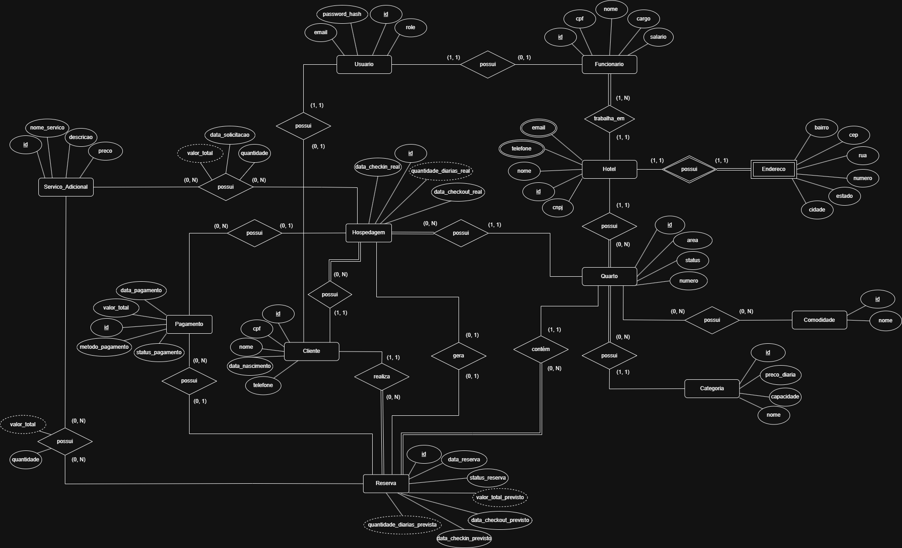

<p align="center">
  
  &nbsp;&nbsp;&nbsp;
  
  &nbsp;&nbsp;&nbsp;
  
  &nbsp;&nbsp;&nbsp;
  
</p>

<h1 align="center">Hotel Reservations</h1>

<p align="center">
  Projeto acadêmico de banco de dados para sistema de reservas de quartos de hotel
</p>

<p align="center">
  
  
  
  
</p>

<p align="center">
  
  
  
</p>

---

## Descrição

---

O Hotel Reservations Database é um projeto acadêmico desenvolvido para a disciplina de Banco de Dados, cujo objetivo é a modelagem, implementação e validação de um banco de dados relacional para um sistema de gerenciamento de reservas de hotel.

A plataforma foi projetada para permitir o cadastro e a administração de hotéis, incluindo informações estruturais como categorias de quartos, comodidades disponíveis, capacidade de hospedagem e organização dos quartos por hotel. Cada quarto está associado a uma categoria específica, permitindo a definição de características como capacidade máxima de hóspedes e valor da diária.

No contexto das operações do hotel, o banco de dados dá suporte ao controle de reservas, registrando períodos de check-in e check-out, status da reserva e associação com clientes e quartos. A partir de uma reserva, o sistema permite o acompanhamento da hospedagem, representando a execução real da estadia, com controle de entrada, saída e situação do hóspede.

Além disso, o modelo contempla o registro de pagamentos, permitindo associar transações tanto a reservas quanto a hospedagens, com controle de valores, métodos de pagamento e status, garantindo rastreabilidade financeira e histórico das operações realizadas.

O projeto também prevê suporte a serviços adicionais oferecidos pelo hotel, possibilitando sua associação às reservas e mantendo o valor praticado no momento da contratação, preservando a consistência histórica dos dados.

---

## Modelagem do Banco de Dados

Abaixo estão representados os modelos desenvolvidos para a estruturação do sistema.

### Diagrama conceitual


### Diagrama lógico


---

## Dicionário de Dados

A documentação completa dos metadados, incluindo descrição das tabelas, colunas, tipos de dados e restrições, pode ser consultada no arquivo abaixo:

[Visualizar Dicionário de Dados (PDF)](./docs/database/dicionario-de-dados.pdf)

---

## Estado atual do projeto

Atualmente, o projeto encontra-se na fase de **implementação e validação do banco de dados**, contendo:

- Esquema lógico relacional implementado em SQL;
- Banco de dados normalizado (Segunda Forma Normal);
- Migrations SQL versionadas utilizando Flyway;
- Infraestrutura containerizada com Docker e Docker Compose;
- Backend em Java com Spring Boot utilizado para validação do schema via Hibernate;
- Organização do repositório, fluxo de contribuição e padrões de versionamento;
- Utilização de quadro Scrum para organização e acompanhamento das atividades da equipe.

---

## Tecnologias Utilizadas

### Backend

* Java
* Spring Boot
* Spring Web
* Spring Data JPA
* PostgreSQL

### Ferramentas e práticas

* Git
* GitHub
* Docker
* Conventional Commits
* Pull Requests com revisão obrigatória

---

## Instalação e Execução

### Configuração de ambiente (.env)

Este projeto **não versiona arquivos `.env`**.  
Você **deve criar dois arquivos `.env` próprios**:

- Um na **raiz do projeto (backend)**
- Um dentro da pasta **frontend/**

Sem esses arquivos corretamente configurados, a aplicação não funcionará como esperado.

---

## 1️⃣ Backend (.env na raiz)

Use o arquivo `.env.example` como base:

```env
# Senha do usuário do banco de dados PostgreSQL
HOTEL_RESERVATIONS_DB_PASSWORD=mude_a_senha_aqui

# Profile ativo do Spring Boot
SPRING_PROFILES_ACTIVE=dev

# Origens permitidas para CORS (opcional)
# Se não definir, o backend usa o valor padrão do application.yml
CORS_ALLOWED_ORIGINS=http://localhost:3000,http://localhost:5173

# Versão da aplicação (opcional)
APP_VERSION=dev

# Configurações para JWT
JWT_SECRET=rjfoBSJbdo2DWCXzgWw42ug9VndCxurWHfAh71kq36o=
JWT_EXPIRATION_MS=86400000
```

Crie o seu `.env` copiando o exemplo:

```bash
cp .env.example .env
```

Depois, ajuste os valores conforme necessário (principalmente senha do banco).

---

## 2️⃣ Frontend (frontend/.env)

Dentro da pasta:

```
frontend/
```

Crie o arquivo:

```
.env
```

Com o seguinte conteúdo:

```env
# URL da API do Backend
VITE_API_URL=http://localhost:8080

# Define se a aplicação deve usar dados falsos (Mock) ou backend real
# true  = Usa dados locais
# false = Conecta na API real
VITE_USE_MOCK=false
```

---

### Perfis de execução do projeto

O projeto possui duas formas principais de execução, controladas via **`SPRING_PROFILES_ACTIVE`** no **`.env`**

#### Execução com Docker (com seed)

- **`SPRING_PROFILES_ACTIVE=dev`**
- Banco e backend sobem via Docker Compose
- Seeder é executado automaticamente
- Migrations padrão + migrations de desenvolvimento

Esse profile é indicado para desenvolvimento inicial e testes rápidos.

---

#### Execução com Docker (sem seed)

- **`SPRING_PROFILES_ACTIVE=prod`**
- Banco e backend sobem via Docker Compose
- Seeder não é executado
- Apenas migrations oficiais

Esse profile simula o comportamento de produção.

---

### Subindo a aplicação com Docker Compose

Na raiz do projeto, execute:

```bash
docker compose up --build -d
````

O comando irá subir o banco de dados PostgreSQL e o backend, além de executar automaticamente as migrations via Flyway.

### Verificando containers em execução

```bash
docker ps
```

### Acessando o banco de dados

```bash
docker exec -it hotel-reservations-db-1 psql -U hotel_reservations_dev_app -d hotel_reservations_dev
```

### Parando a aplicação

```bash
docker compose down
```

Para remover os volumes e reiniciar o banco do zero:

```bash
docker compose down -v
```

### Serviços disponíveis

* Frontend: [http://localhost:5173](http://localhost:5173)
* Backend: [http://localhost:8080](http://localhost:8080)
* Banco de Dados: localhost:5433

---

## População de Dados (Data Seeding)

A base de dados inicial do sistema foi populada com o auxílio de Inteligência Artificial para criar um conjunto de dados fictícios (*mock data*) realista e coerente. O processo foi estruturado nas seguintes etapas:

1. **Mapeamento:** A estrutura das tabelas do banco (como Clientes, Hotéis, Quartos e Reservas) foi utilizada como contexto.
2. **Geração:** A IA elaborou scripts SQL de `INSERT` com registros diversificados, respeitando os relacionamentos e restrições estruturais do banco (chaves estrangeiras, formatos de data, etc.).
3. **Execução:** Os scripts foram executados diretamente no banco de dados, garantindo volume de informações suficiente para testes de API e validação das regras de negócio.
 
---

## Instruções de Uso

### Credenciais Padrão (Seed)

O sistema já possui usuários cadastrados para testes:

#### Gerente
- **Email:** funcionario@local.dev
- **Senha:** password  

#### Cliente
- **Email:** user1@local.dev  
- **Senha:** password1  

---

### Funcionalidades Disponíveis

#### Integração de Cadastro
Permite o cadastro de novos usuários no sistema.

#### Integração de Login
Autenticação via email e senha, com geração de token JWT.

#### Integração de Reservas Detalhadas
Consulta detalhada das reservas realizadas, incluindo dados de quartos e período, no perfil de gerente.

#### Integração de Quartos Disponíveis
Listagem de quartos disponíveis para um intervalo de datas informado, na homepage

#### Integração de Quarto por ID
Consulta individual de um quarto específico

#### Integração de Cadastro de Reserva
Criação de nova reserva informando cliente, período e quarto desejado.

#### Integração de relatório
Consulta dados administrativos do sistema

### Observação sobre o uso de Views

As funcionalidades de **Reservas Detalhadas**, **Quartos Disponíveis** e **Relatório** utilizam *views* no banco de dados.

A principal vantagem é que, em vez de a aplicação precisar buscar vários IDs e depois realizar múltiplas consultas adicionais para montar a resposta, as junções entre tabelas já são feitas diretamente no banco.

Exemplo da view de reservas, que junta as tabelas de cliente e quarto para informar dados dessas tabelas sem consultas adicionais.

---

## Guia de Contribuição

O projeto segue um fluxo de contribuição organizado, utilizando boas práticas de versionamento, colaboração em equipe e gerenciamento de tarefas.

### Organização da equipe e tarefas

A equipe utiliza o **GitHub Projects (Quadro Scrum)** como ferramenta de organização e acompanhamento do desenvolvimento do projeto. O fluxo adotado é o seguinte:

- As funcionalidades, correções e melhorias são registradas como **Issues** no repositório;
- Cada issue é adicionada ao **Quadro Scrum** e atribuída a um integrante da equipe;
- O progresso das tarefas é acompanhado por meio das colunas do quadro (por exemplo: *To Do*, *In Progress* e *Done*);
- As issues são resolvidas por meio de **commits** e **Pull Requests**, mantendo a rastreabilidade entre planejamento e código;
- Commits e Pull Requests podem:
    - referenciar a issue relacionada (`Related to #id`), ou
    - encerrar automaticamente a issue ao final do desenvolvimento (`Closes #id`).

### Fluxo de versionamento

- Cada integrante trabalha em um **fork** do repositório principal;
- A branch `main` é **protegida**, não permitindo commits diretos;
- Todas as alterações são realizadas por meio de **Pull Requests**;
- Cada Pull Request exige:
    - uso do padrão **Conventional Commits**;
    - no mínimo **2 revisores**;
    - resolução de todos os comentários antes do merge.

### Padrão de commit

```

feat(escopo): descrição curta

```

Exemplo:

```

feat(backend): initialize Spring Boot application structure

- Criada a estrutura inicial do backend em Java com Spring Boot
- Configurada a base do projeto para integração com PostgreSQL
- Ajustadas configurações iniciais do workspace e ambiente de execução

Related to #10

```

---

## Contribuidores

* **[Alcielma Luzinete da Silva](https://github.com/Alcielma)**
* **[Hugo Matheus Costa Araújo](https://github.com/hugomtths)**
* **[Luís Henrique Domingos da Silva](https://github.com/LuisH07)**
* **[Maria Luiza Bezerra dos Santos](https://github.com/marialuizab11)**

---

## Licença

Este projeto está licenciado sob a **Licença MIT**.
Veja o arquivo [LICENSE](LICENSE) para mais detalhes.

---
